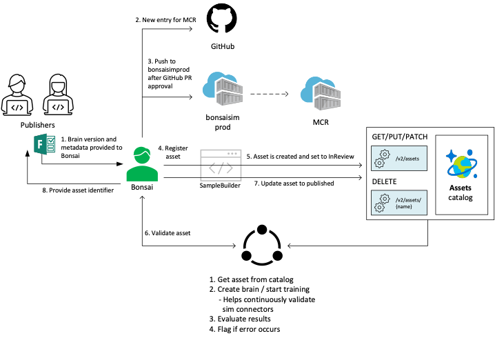
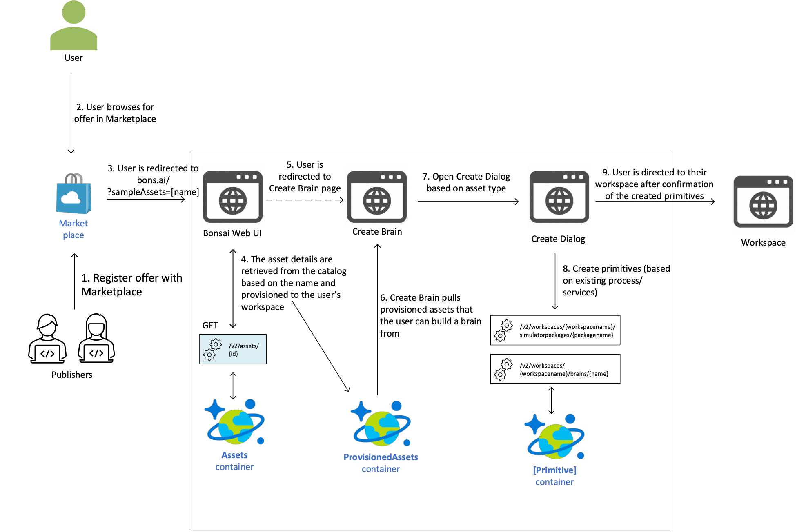

# Listing a Bonsai Sample in the Azure Marketplace
- Make your sample discoverable from the UI
- Demonstrate the sample capabilities through videos and overview and design documents
- leverage the "Contact me" button in the Azure Marketplace
- Sample can be provisioned directly from announcements, blogs, and social media

## How to publish an asset in the Azure Marketplace

## How to provision an asset in the Azure Marketplace

